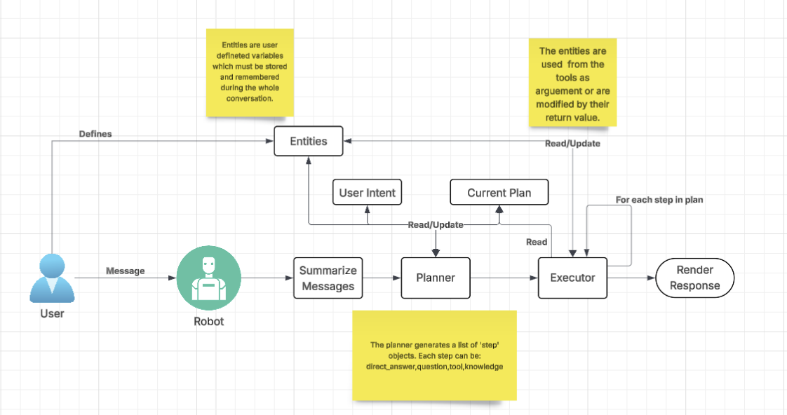

# Agent Framework

> **Disclaimer:** This project is for testing/demo purposes only. It is **not intended for production use** without prior review and modifications.

## Introduction
This project started as a codebase to explore the fundamentals of building an AI agent from scratch. Over time, it evolved into my own version of a “perfect” agent by adding features I consider crucial for real-world problem-solving.

## High-Level Overview


## Main Features

### Custom Entities
The core feature of this framework is the ability to define **custom entities** during agent setup. These entities are variables that can be used in both the planning and execution phases:

- **Planning phase:** Entities help the agent understand user intent and define tool arguments without asking unnecessary questions.  
- **Execution phase:** Entities can be updated based on function outputs. If a function returns a value matching an entity name, the entity is updated and stored in the agent context for subsequent interactions.

### Summarizer
The summarizer condenses previous messages into a concise **user intent** representation. This helps the planner work with essential information, avoiding unnecessary noise. When used with a cheaper model, summarization can also help reduce operational costs.

## Requirements

### Python Packages
```bash
boto3
json
```

### Prompts
Review the main prompts in `./prompts.py` for:
- Summarization  
- Planning  
- Knowledge DB message generation  
- Formatting messages from raw data and user queries  

### Knowledge Base
This project uses a knowledge database built with **AWS Bedrock**. The knowledge base IDs are defined in `./knowledge.py`. Example:

```python
KNOWLEDGE = [
    {
        'name': 'Accounting Manual for AP',
        'description': "Documentation about the Accounts Payable process",
        'knowledge_base_id': 'TVD6QFV2G7',
    },
    {
        'name': 'Accounting Manual for AR',
        'description': "Documentation about the Accounts Receivable process",
        'knowledge_base_id': 'TVD6QFV2G7',
    },
    {
        'name': 'Accounting Manual for GL',
        'description': "Documentation about the General Ledger process",
        'knowledge_base_id': 'TVD6QFV2G7',
    }
]
```

### Tools
Update the files in the `tools` folder:
- `data.py` – dummy data  
- `invoke.py` – maps tool names to function objects  
- `logic.py` – tool logic functions  
- `tool_descriptions.py` – descriptions and arguments of each tool  

### Environment Variables
If needed, configure your AWS keys or rely on your system AWS credentials file.

## Usage Example
```python
from agent import Agent
from knowledge import KNOWLEDGE
from tools.tools_descriptions import TOOLS
from llm.super_llm import LLM

# Define custom entities
entities = [
    {'name': 'user_name', 'description': 'Name of the user', 'value': ''},
    {'name': 'entity', 'description': 'Name of the entity user is interested in', 'examples': ['IT','PL','DE','FR','ES'], 'value': ''},
    {'name': 'user_role', 'description': 'Role of the user', 'value': ''}
]

# Agent setup
instructions = "You're a helpful assistant expert in accounting."
rules = "Never provide false information"
role = 'AI Agent for Accounting'
responsible_for = 'Assist users in resolving issues and requests'

agent = Agent(instructions, rules, KNOWLEDGE, TOOLS, entities=entities, role=role, responsible_for=responsible_for)

# LLMs for different functions
planner = LLM('Planner')
generator = LLM('Generator')
summarizer = LLM('Summarizer')

agent.set_planner(planner)
agent.set_answer_generator(generator)
agent.set_summarizer(summarizer)
agent.start()
```

## Notes
This framework is designed primarily for learning and experimentation. It demonstrates how to build a functional AI agent and extend it with custom features.

## Future Enhancements
- **Cost Optimization:** Use cheaper models for non-critical tasks like summarization.  
- **Microsoft Teams Integration:** Enable generation of Teams-adaptive messages (cards, suggested responses, etc.).  
- **Testing:** Implement testing scenarios with alternative LLMs to validate conversation flow and expected outcomes.

